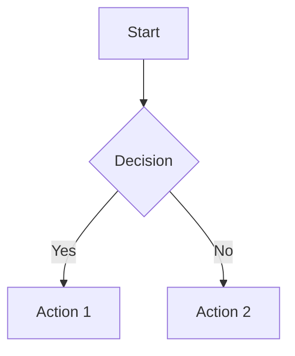

# Slidev完全ガイド - 開発者向けプレゼンテーションツール

## 目次
1. [Slidevとは](#slidevとは)
2. [インストールと初期設定](#インストールと初期設定)
3. [基本的な使い方](#基本的な使い方)
4. [フロントマター設定](#フロントマター設定)
5. [Markdownシンタックス](#markdownシンタックス)
6. [テーマとレイアウト](#テーマとレイアウト)
7. [コンポーネント機能](#コンポーネント機能)
8. [エクスポート機能](#エクスポート機能)
9. [高度な機能](#高度な機能)
10. [トラブルシューティング](#トラブルシューティング)

---

## Slidevとは

**Slidev** (slide + dev, `/slʌɪdɪv/`) は、開発者向けのWebベースなMarkdownスライド作成・プレゼンテーションツールです。

### 開発者
- **Anthony Fu** - Vue.jsコアチーム、Vue Use・Type Challengesの作者
- リリースから数日で7,000を超えるGitHubスターを獲得

### 主な特徴
- 📝 **Markdownベース** - 拡張されたMarkdown記法でスライド作成
- 🧑‍💻 **開発者フレンドリー** - コードハイライト、ライブコーディング対応
- 🎨 **豊富なテーマ** - npmパッケージでテーマ共有・利用
- 🤹 **インタラクティブ** - Vueコンポーネント埋め込み可能
- ⚡️ **高速** - Viteによる即時リロード
- 🎥 **レコーディング** - 内蔵録画・カメラビュー機能

### 技術スタック
- **Vite** - 高速フロントエンドツール
- **Vue 3** - 最新Vue.js
- **Windi CSS** - ユーティリティファーストCSS
- **Prism/Shiki** - シンタックスハイライト
- **Monaco Editor** - VSCodeライクなエディタ

---

## インストールと初期設定

### 動作要件
- **Node.js >= 14.0**

### クイックスタート

**NPMの場合:**
```bash
npm init slidev@latest
```

**Yarnの場合:**
```bash
yarn create slidev
```

### インストールプロセス
1. プロジェクト名を入力
2. パッケージマネージャを選択（npm/yarn）
3. 依存関係の自動インストール
4. ブラウザが自動で開く（http://localhost:3030）

### マニュアルインストール
```bash
npm install @slidev/cli @slidev/theme-default
```

### グローバルインストール
```bash
npm i -g @slidev/cli
# どこでもslidevコマンドが使用可能
```

### pnpm使用時の注意
```bash
echo 'shamefully-hoist=true' >> .npmrc
```

---

## 基本的な使い方

### プロジェクト構造
```
my-slidev/
├── slides.md          # メインスライドファイル
├── package.json       # プロジェクト設定
├── components/        # カスタムコンポーネント（オプション）
├── layouts/          # カスタムレイアウト（オプション）
├── public/           # 静的ファイル（オプション）
├── styles/           # カスタムスタイル（オプション）
└── vite.config.ts    # Vite設定
```

### 基本コマンド

**開発サーバー起動:**
```bash
npm run dev
# または
slidev
```

**ビルド（SPA作成）:**
```bash
npm run build
# または
slidev build
```

**PDFエクスポート:**
```bash
npm run export
# または
slidev export
```

**PNGエクスポート:**
```bash
slidev export --format png
```

### 基本的なスライド作成

**slides.md:**
```markdown
---
theme: default
title: 'My Presentation'
---

# スライド1
Welcome to Slidev!

---

# スライド2
## サブタイトル
- 項目1
- 項目2

---

# スライド3
```ts
console.log('Hello, Slidev!')
```
```

---

## フロントマター設定

スライドの先頭や各ページに設定可能な項目です。

### グローバル設定（全スライド共通）
```yaml
---
# テーマ設定
theme: default
title: 'プレゼンテーションタイトル'
titleTemplate: '%s - Slidev'

# 表示設定
aspectRatio: '16/9'
canvasWidth: 980
colorSchema: 'auto' # dark, light, all, auto

# 機能設定
lineNumbers: false
monaco: dev # true, false, dev, build
download: false
codeCopy: true
selectable: true
record: dev

# フォント設定
fonts:
  sans: 'Roboto'
  serif: 'Roboto Slab'
  mono: 'Fira Code'

# テーマカスタマイズ
themeConfig:
  primary: '#5d8392'
---
```

### 個別スライド設定
```yaml
---
layout: center
background: https://source.unsplash.com/1920x1080/?nature
class: text-white
---

# このスライドは中央レイアウト
```

### 主要設定項目

| 項目 | 説明 | デフォルト |
|------|------|-----------|
| `theme` | 使用テーマ | `default` |
| `layout` | スライドレイアウト | `default` |
| `background` | 背景画像・色 | なし |
| `class` | CSSクラス | なし |
| `clicks` | クリック数 | 自動計算 |
| `preload` | 事前読み込み | `true` |
| `routerMode` | ルーターモード | `history` |
| `aspectRatio` | アスペクト比 | `16/9` |
| `canvasWidth` | キャンバス幅 | `980` |
| `exportFilename` | エクスポート時ファイル名 | `slides-export` |
| `highlighter` | ハイライター | `prism` |
| `lineNumbers` | 行番号表示 | `false` |
| `monaco` | Monacoエディタ | `dev` |
| `remoteAssets` | リモートアセット | `false` |
| `selectable` | テキスト選択可能 | `true` |
| `colorSchema` | カラースキーマ | `auto` |

---

## Markdownシンタックス

### スライド区切り
```markdown
# スライド1
内容

---

# スライド2  
内容

---layout: center---

# スライド3（レイアウト指定）
```

### コードブロック
````markdown
```ts
interface User {
  name: string
  age: number
}

const user: User = {
  name: 'Slidev',
  age: 2
}
```
````

### 行ハイライト
````markdown
```ts {1,3-4}
console.log('1行目がハイライト')
console.log('この行は通常')
console.log('3-4行目が')
console.log('ハイライト')
```
````

### 段階的表示
````markdown
```ts {1|2|3}
console.log('最初に表示')
console.log('次に表示')
console.log('最後に表示')
```
````

### Monacoエディタ（ライブコーディング）
````markdown
```ts {monaco}
console.log('編集可能なコード')
```
````

### 数式（LaTeX）
```markdown
インライン数式: $x = {-b \pm \sqrt{b^2-4ac} \over 2a}$

ブロック数式:
$$
\frac{1}{c^2}\frac{\partial^2\mathbf{E}}{\partial t^2} = \nabla^2 \mathbf{E}
$$
```

### 図形（Mermaid）
````markdown

````

### アイコン
```markdown
<!-- Iconifyアイコン -->
<carbon-logo-vue />
<mdi-account-circle />

<!-- カスタムサイズ -->
<carbon-logo-vue class="text-3xl" />
```

### 段階的表示要素
```markdown
<v-clicks>

- 最初のクリックで表示
- 2回目のクリックで表示
- 3回目のクリックで表示

</v-clicks>

<!-- 指定クリック数で表示 -->
<v-click at="2">2回目のクリックで表示</v-click>
```

---

## テーマとレイアウト

### テーマの利用

**1. 公式テーマギャラリーから選択:**
- https://ja.sli.dev/themes/gallery

**2. テーマのインストール:**
```bash
npm install @slidev/theme-seriph
```

**3. テーマの適用:**
```yaml
---
theme: seriph
---
```

### 人気テーマ
- **default** - Slidevデフォルトテーマ
- **seriph** - セリフフォントの洗練されたテーマ
- **apple-basic** - Apple風のシンプルテーマ
- **bricks** - ブロック風デザイン
- **geist** - Vercel Geist風

### レイアウト一覧（defaultテーマ）

| レイアウト | 用途 |
|-----------|------|
| `default` | 標準レイアウト |
| `center` | 中央揃え |
| `cover` | カバーページ |
| `intro` | 紹介ページ |
| `section` | セクション区切り |
| `quote` | 引用 |
| `fact` | 事実・統計 |
| `statement` | 重要な声明 |
| `image` | 画像メイン |
| `image-left` | 左側に画像 |
| `image-right` | 右側に画像 |
| `two-cols` | 2カラム |
| `iframe` | iframe埋め込み |
| `iframe-left` | 左側にiframe |
| `iframe-right` | 右側にiframe |

### レイアウト使用例
```markdown
---
layout: two-cols
---

# 左カラム
内容

::right::

# 右カラム  
内容

---
layout: image-right
image: https://source.unsplash.com/400x400/?cat
---

# テキスト部分
画像が右側に表示される
```

### カスタムテーマ作成
```bash
# テーマ作成
npm init slidev-theme my-theme

# 必要ファイル
layouts/
├── default.vue
├── cover.vue
└── center.vue
components/
├── MyComponent.vue
styles/
├── index.ts
└── layout.css
```

---

## コンポーネント機能

### 内蔵コンポーネント

#### YouTube埋め込み
```markdown
<YouTube id="luoMHjh-XcQ" width="400" height="280" />
```

#### Twitter埋め込み  
```markdown
<Tweet id="20" />
```

#### 目次
```markdown
<Toc />
```

#### クリック表示制御
```markdown
<v-clicks>

- アイテム1
- アイテム2  
- アイテム3

</v-clicks>

<v-click>クリック1回で表示</v-click>
<v-click at="3">クリック3回で表示</v-click>
```

#### アニメーション
```markdown
<v-motion
  :initial="{ x: -80 }"
  :enter="{ x: 0 }"
  :click-3="{ x: 80 }"
>
  アニメーション要素
</v-motion>
```

### カスタムコンポーネント

**components/MyButton.vue:**
```vue
<template>
  <button 
    class="px-4 py-2 bg-blue-500 text-white rounded"
    @click="$emit('click')"
  >
    <slot />
  </button>
</template>

<script setup>
defineEmits(['click'])
</script>
```

**スライドでの使用:**
```markdown
<MyButton @click="handleClick">
  クリックしてね
</MyButton>

<script setup>
const handleClick = () => {
  alert('クリックされました！')
}
</script>
```

### スタイル指定

**インラインスタイル:**
```markdown
<div class="text-center text-2xl text-blue-500">
中央揃えの大きな青色テキスト
</div>
```

**埋め込みCSS:**
```markdown
<style>
.custom-class {
  color: #ff6b6b;
  font-size: 1.5rem;
}
</style>

<div class="custom-class">カスタムスタイル</div>
```

---

## エクスポート機能

### 事前準備
```bash
# Playwright Chromiumのインストール
npm i -D playwright-chromium
```

### PDF エクスポート
```bash
# 基本エクスポート
slidev export

# オプション指定
slidev export --output my-slides.pdf
slidev export --format pdf
slidev export --timeout 30000
slidev export --range 1,3-5,8
```

### PNG エクスポート
```bash
# 全スライドをPNG画像として出力
slidev export --format png

# 出力ディレクトリ指定
slidev export --format png --output ./images/
```

### SPA ビルド
```bash
# Single Page Applicationとしてビルド
slidev build

# 出力ディレクトリ指定
slidev build --out dist
```

### エクスポートオプション

| オプション | 説明 | デフォルト |
|-----------|------|-----------|
| `--output` | 出力ファイル名 | `slides-export` |
| `--format` | 出力形式（pdf/png/md） | `pdf` |
| `--timeout` | タイムアウト（ms） | `30000` |
| `--range` | エクスポート範囲 | 全て |
| `--dark` | ダークモード | `false` |
| `--with-clicks` | クリックアニメーション含む | `false` |
| `--per-slide` | スライド毎に個別ファイル | `false` |

---

## 高度な機能

### プレゼンターモード
```bash
# プレゼンターモード起動
slidev --presenter

# アクセスURL
# スライド表示: http://localhost:3030/
# プレゼンター: http://localhost:3030/presenter
```

### リモートコントロール
```bash
# リモート制御を有効化
slidev --remote

# パスワード設定
slidev --remote=mypassword
```

### 録画機能
```yaml
---
record: true  # または 'dev', 'build'
---
```

ブラウザでスライドを開き、録画ボタンをクリック

### 描画機能
スライド表示中に`d`キーを押すと描画モードになります。

### ホットキー
- `→` / `Space` - 次のスライド
- `←` - 前のスライド  
- `↑` - 前のクリック
- `↓` - 次のクリック
- `o` - スライド一覧
- `d` - 描画モード
- `f` - フルスクリーン
- `g` - ページ移動ダイアログ

### Vite設定カスタマイズ

**vite.config.ts:**
```ts
import { defineConfig } from 'vite'

export default defineConfig({
  slidev: {
    vue: {
      // Vue設定
    },
    markdown: {
      // Markdown設定
    }
  }
})
```

### Monaco Editor設定

**slides.md:**
```yaml
---
monaco: true
---
```

**setup/monaco.ts:**
```ts
import { defineMonacoSetup } from '@slidev/types'

export default defineMonacoSetup(async (monaco) => {
  // Monaco Editor のカスタマイズ
  await import('monaco-editor/esm/vs/language/typescript/typescript.worker')
})
```

---

## トラブルシューティング

### よくある問題と解決方法

#### 1. スライドが表示されない
```bash
# Node.jsバージョン確認
node --version  # 14.0以上が必要

# 依存関係の再インストール
rm -rf node_modules package-lock.json
npm install
```

#### 2. テーマが適用されない
```bash
# テーマがインストールされているか確認
npm list @slidev/theme-seriph

# テーマの再インストール
npm install @slidev/theme-seriph
```

#### 3. エクスポートが失敗する
```bash
# Playwrightのインストール確認
npm list playwright-chromium

# ブラウザの手動インストール
npx playwright install chromium
```

#### 4. pnpm使用時のエラー
```bash
# .npmrcファイルに追加
echo 'shamefully-hoist=true' >> .npmrc
```

#### 5. フォントが表示されない
```yaml
---
fonts:
  sans: 'Noto Sans JP'  # Google Fontsから自動取得
---
```

#### 6. 開発サーバーが起動しない
```bash
# ポートが使用中の場合
slidev --port 3333

# HTTPS で起動
slidev --https
```

### デバッグ方法

**詳細ログの有効化:**
```bash
DEBUG=slidev* slidev
```

**ブラウザ開発者ツールの利用:**
- F12でConsoleを確認
- Networkタブでリソース読み込み状況確認

### パフォーマンス最適化

**大きなファイルの扱い:**
```yaml
---
remoteAssets: false  # リモート画像の無効化
preload: false      # 事前読み込みの無効化
---
```

**カスタムCSS最適化:**
```yaml
---
css: unocss  # UnoCSSを使用（実験的）
---
```

---

## 参考リンク

### 公式ドキュメント
- [Slidev公式サイト](https://ja.sli.dev/)
- [GitHub リポジトリ](https://github.com/slidevjs/slidev)
- [テーマギャラリー](https://ja.sli.dev/themes/gallery)

### コミュニティ
- [Discord サーバー](https://discord.gg/UBN2mRDb)
- [GitHub Discussions](https://github.com/slidevjs/slidev/discussions)

### 関連ツール
- [Slidev VSCode拡張](https://marketplace.visualstudio.com/items?itemName=antfu.slidev)
- [Vue.js](https://v3.ja.vuejs.org/)
- [Vite](https://ja.vitejs.dev/)
- [Windi CSS](https://windicss.org/)

---

*最終更新: 2025年6月*

このドキュメントがSlidevでの効率的なプレゼンテーション作成の助けになれば幸いです。